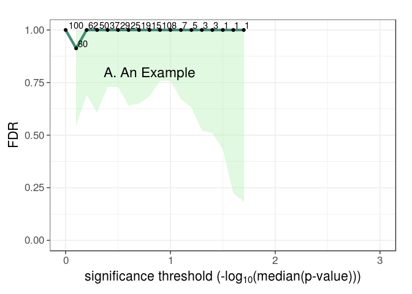

[](https://travis-ci.org/USCbiostats/fdrci)

[](https://ci.appveyor.com/project/gvegayon/fdrci)

<!-- README.md is generated from README.Rmd. Please edit that file -->
fdrci
=====

> FDR functions for permutation-based estimators, including pi0 as well as FDR confidence intervals. The confidence intervals account for dependencies between tests by the incorporation of an overdispersion parameter, which is estimated from the permuted data. --- From the package description

Installation
------------

You can install fdrci from GitHub with:

``` r
# install.packages("devtools")
devtools::install_github("USCbiostats/fdrci")
```

Example
-------

This is a basic example which shows you how to solve a common problem:

``` r
library(fdrci)

ss = 100
nvar = 100
X = as.data.frame(matrix(rnorm(ss*nvar),nrow=ss,ncol=nvar))
Y = as.data.frame(matrix(rnorm(ss*nvar),nrow=ss,ncol=nvar))
nperm = 10

myanalysis = function(X,Y){
    ntests = ncol(X)
    rslts = as.data.frame(matrix(NA,nrow=ntests,ncol=2))
    names(rslts) = c("ID","pvalue")
    rslts[,"ID"] = 1:ntests
    for(i in 1:ntests){
        fit = cor.test(X[,i],Y[,i],na.action="na.exclude",
            alternative="two.sided",method="pearson")
        rslts[i,"pvalue"] = fit$p.value
    }
    return(rslts)
} # End myanalysis

# Generate observed results
obs = myanalysis(X,Y)

# Generate permuted results
perml = vector('list',nperm)
for(p_ in 1:nperm){
    X1 = X[order(runif(nvar)),]
    perml[[p_]] = myanalysis(X1,Y)
}

# FDR results table
myfdrtbl = fdrTbl(obs$pvalue,perml,"pvalue",nvar,0,3)
# Plot results
FDRplot(myfdrtbl,0,3,annot="A. An Example")
#> Warning: Removed 13 rows containing missing values (geom_path).
#> Warning: Removed 13 rows containing missing values (geom_point).
#> Warning: Removed 13 rows containing missing values (geom_text).
```


